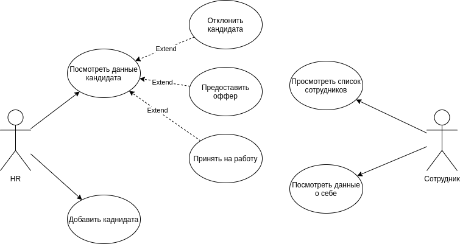
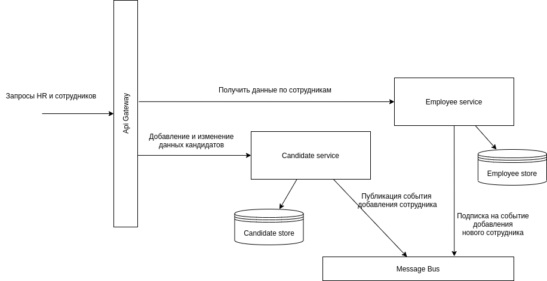
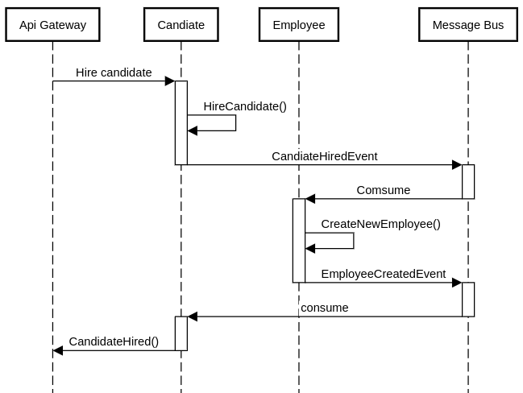

# Система найма персонала

Учебный проект, разрабатываемый в рамках курса "Архитекрура web приложений"

## Описание проекта

### Диаграмма use cases

### Диаграмма сервисов

Система состоит из трех основных компонентов: сервис кандидатов (Candidate service), сервис сотрудников (Employee service) и шины сообщений (Message bus)

### Процесс добавления нового сотрудника из кандидата

